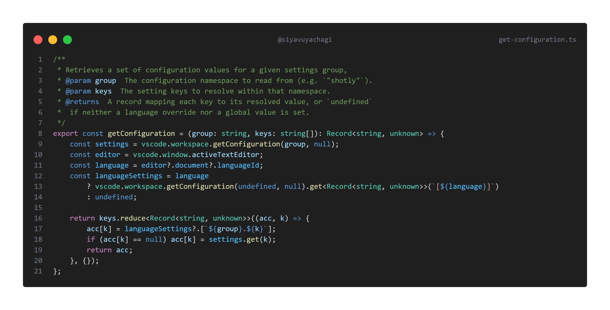
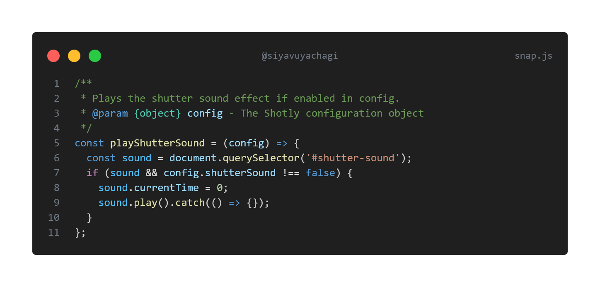

# Shotly 📸

Take beautiful screenshots of your code directly in VS Code.

## Usage

1. Select the code snippet you'd like to screenshot.
2. Right-click and select **Shotly 📸** from the context menu.
3. Adjust the width of the screenshot if desired.
4. Click **Save** to save to disk, or **Copy** to copy to clipboard.

## Examples

## Configuration

| Setting                        | Type      | Default             | Description                                                                                          |
| ------------------------------ | --------- | ------------------- | ---------------------------------------------------------------------------------------------------- |
| `shotly.outDir`                | `string`  | `~/Pictures/Shotly` | Directory to save screenshots                                                                        |
| `shotly.shutterAction`         | `string`  | `save`              | `save` or `copy`                                                                                     |
| `shotly.saveMode`              | `string`  | `manual`            | Save behavior when shutterAction is `save`. `manual` shows a dialog, `auto` saves directly to outDir |
| `shotly.shutterSound`          | `boolean` | `true`              | Play a shutter sound when taking a screenshot                                                        |
| `shotly.target`                | `string`  | `container`         | `container` or `window`                                                                              |
| `shotly.backgroundColor`       | `string`  | ``                  | Background color of the snippet container. Accepts (`#fff`, `rgb()`, `transparent`, named colors)    |
| `shotly.boxShadow`             | `string`  | `gray`              | CSS box-shadow for the snippet                                                                       |
| `shotly.containerPadding`      | `string`  | `3em`               | Padding for the snippet container                                                                    |
| `shotly.roundedCorners`        | `boolean` | `true`              | Use rounded corners for the window                                                                   |
| `shotly.transparentBackground` | `boolean` | `true`              | Use transparent background when taking the screenshot                                                |
| `shotly.showWindowControls`    | `boolean` | `true`              | Show macOS style window controls                                                                     |
| `shotly.showWindowTitle`       | `boolean` | `false`             | Show window title with folder/file name                                                              |
| `shotly.watermark`             | `string`  | ``                  | Watermark text displayed in the title bar alongside the window controls e.g. `@siyavuyachagi`        |
| `shotly.showLineNumbers`       | `boolean` | `true`              | Show line numbers                                                                                    |
| `shotly.realLineNumbers`       | `boolean` | `false`             | Start from the file's real line number                                                               |

## Acknowledgements

Inspired by [CodeSnap](https://github.com/kufii/CodeSnap) and [Polacode](https://github.com/octref/polacode).

Design inspiration from [Carbon](https://carbon.now.sh/).
